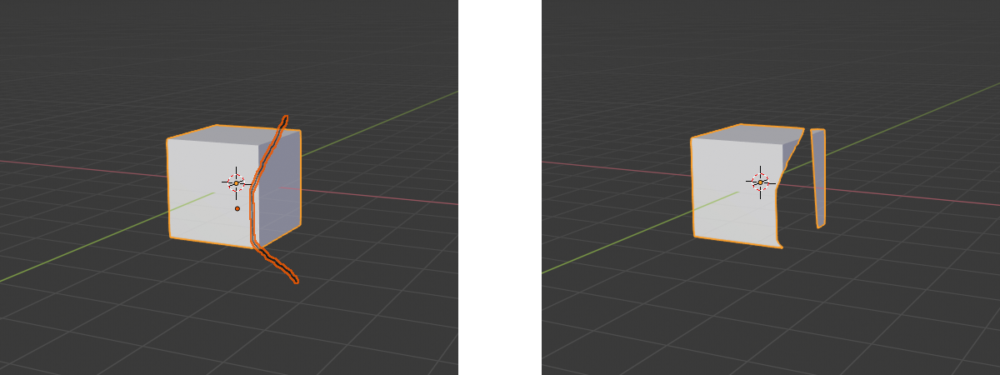

Using the View Carve Addon
==========================

Basic Information
-----------------

Once installed, the View Carve addon adds a new operator called "Viewport Stencil Carve" to Blender. The operator can be
accessed from the Object menu in the 3D viewport. To use the operator, you must select all the objects you want to use
as stencils, along with the target mesh object to be cut. The target mesh should be the last object selected, i.e. the
active object. The following types of objects can be used as stencils:

- Grease Pencil objects
- Curves
- Meshes
- Surfaces
- Text objects

The following before-and-after screenshots show the result of using some Grease Pencil strokes and meshes as stencils to
cut a cube:

Operator Options
----------------

The following properties can be set in the operator properties panel after applying the Viewport Stencil Carve operator:

- Pieces to Keep. This property determines which pieces resulting from the cut will be kept or discarded. The default
  value of All will cause the target mesh to be cut into pieces, with all pieces kept as separate objects. With the
  other two possible values, only one piece will be kept. If the property is set to Difference, only the piece that lies
  outside all the stencils will be kept. If the property is set to Intersection, only the piece that lies inside all the
  stencils will be kept. (In the case of Intersection, if the stencils don't all overlap, there will be no piece to
  keep, and the target mesh will simply be deleted.)
- Union Carves. When enabled, this property causes all the stencils to be treated as if they were a single stencil
  object, obtained by taking the Boolean union of the stencils. This property is only relevant if Pieces to Keep is All
  and there are multiple stencil objects. When this property is enabled, the cut will result in at most two pieces.
- Delete Carver Objects. When enabled, this property causes the stencil objects to be deleted after they have been used
  to cut the target mesh. This can be convenient if you created the stencil objects for the sole purpose of acting as
  stencils.
- Overlap Threshold. This property controls the Overlap Threshold parameter for the Boolean operations that the Viewport
  Stencil Carve operator uses internally. It can usually be left at its default value.
- Stencil Grow Ratio. To reduce the chance of generating bad geometry, View Carve uses a slightly larger stencil area
  than that defined by the stencil objects. This property controls how much larger the stencil area will be. It can
  usually be left at its default value, but you may want to try increasing it if bad geometry is being generated, or
  decreasing it if the cut is not accurate enough. (Larger values make bad geometry less likely to occur but also reduce
  the accuracy of the cut.) Setting this property to zero is not recommended, as it makes the generation of bad geometry
  quite likely.

Notes on Stroke and Curve Behavior
----------------------------------

When using Grease Pencil or Curve objects as stencils, there are a few things to consider:

- The thickness and filling of Grease Pencil strokes are not taken into account. In other words, Grease Pencil strokes
  are treated like infinitely thin curves.

- If the curve is closed or intersects itself (or appears to do so in the viewport's projection), the region enclosed by
  the curve is used as the stencil, as in the following screenshots.

- If the curve is not closed and does not intersect itself, the curve will be auto-closed, i.e. treated as if its first
  and last points were joined by a straight line, as in the following screenshots.

Caveats
-------

When using the Viewport Stencil Carve operator, any unapplied modifiers on mesh objects (including the target mesh or
stencil meshes) or grease pencil objects will essentially be ignored. The cut applies to the target mesh's base
geometry, not to its geometry after modifiers. This can lead to surprising behavior if a target or stencil object has
unapplied modifiers. Note, however, that unapplied modifiers on stencil objects other than meshes and grease pencil
objects (e.g. curves, surfaces, text) are *not* ignored.

When using strokes or curves as stencils, be aware that the cut may sometimes generate bad geometry, or fail to occur at
all, if one of the following is true:

- A curve intersects itself at more than one point in the viewport (including after auto-closing).
- A curve is both closed *and* self-intersecting in the viewport.

The issues with these conditions occur fairly inconsistently. This behavior is a bug, but likely will not be fixed in
the near future, because it is difficult to fix and relatively easy to avoid in most use cases. To avoid the issue, try
to avoid using stencil objects that meet either of the above criteria. Curves that self-intersect at *one* point should
be fine, as well as closed (or auto-closed) curves that do not self-intersect.